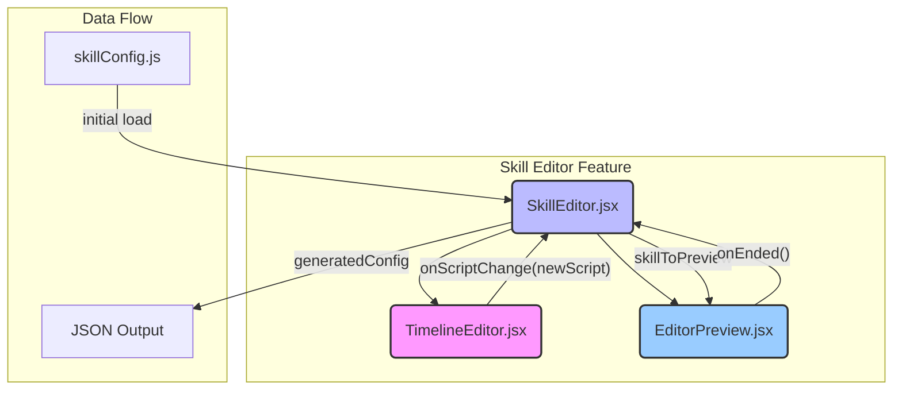

# 技能动画导演编辑器 - README

## 1. 设计哲学与用途

技能动画导演编辑器是一个强大的可视化工具，旨在**将技能的视觉表现（动画、特效、音效）与游戏逻辑彻底分离**。

它的核心用户是**策划和美术（TA）**，同时也服务于**开发者**。通过这个编辑器，非编程人员可以直观地编排复杂、多层次、时序精确的技能动画，而无需编写任何代码。开发者则负责创建可供编排的"动画片段"（如一个"挥砍"动画或一个"火焰"特效），并在需要时将编辑器生成的配置集成到游戏中。

**核心目标:**
-   **所见即所得**: 提供实时预览，让创作者能立即看到修改效果。
-   **解耦**: 将"动画该如何播放"的决策权从代码中移出，变为一份可配置的JSON"剧本"。
-   **提高效率**: 大幅缩短创建和调整技能表现的周期。
-   **提升表现力**: 允许创作者轻松实现复杂的动画序列，如延迟、多段打击、镜头晃动等。

---

## 2. 核心概念

### 2.1 动画剧本 (Animation Script)

这是编辑器的核心产物。一个动画剧本是一个**JSON对象数组**，定义了一个技能动画的所有步骤。数组中的每个对象都是一个**动画指令**。

**示例 `animationScriptTemplate`:**
```json
[
  {
    "type": "ENTITY_ANIMATION",
    "target": "source",
    "delay": 0,
    "animationName": "attack_lunge"
  },
  {
    "type": "WAIT",
    "delay": 250
  },
  {
    "type": "FLOATING_TEXT",
    "target": "target",
    "delay": 300,
    "text": "-${damage}",
    "color": "#dc3545"
  },
  {
    "type": "ENTITY_ANIMATION",
    "target": "target",
    "delay": 300,
    "animationName": "take_hit_shake"
  }
]
```
在这个例子中：
-   `type`: 指令的类型（实体动画、等待、浮动文字等）。
-   `target`: 指令作用的目标（`source`指技能释放者，`target`指技能目标）。
-   `delay`: 该指令在动画开始后 **多少毫秒** 执行。这是实现时序控制的关键。
-   其他参数: 根据 `type` 不同而变化，如 `animationName`, `text`, `color` 等。

### 2.2 时间轴 (Timeline)

时间轴是动画剧本的可视化表现。在编辑器中，每个动画指令都显示为时间轴上的一个可拖动的步骤。用户可以通过调整步骤的顺序和每个步骤的延迟滑块，来直观地编排整个动画的流程。

### 2.3 技能配置结构 (`skillConfig.js`)

`skillConfig.js` 文件是整个技能系统的核心数据源，是连接**游戏逻辑**、**动画表现**和**技能编辑器**的桥梁。编辑器读取它来展示和修改技能，战斗引擎读取它来执行技能效果。

该文件导出一个名为 `skills` 的对象，其结构如下：

```javascript
export const skills = {
  // 技能的唯一ID，也是这个对象中的键。
  'skill_id': {
    // ... Skill Object ...
  },
  // ... more skills
};
```

#### 单个技能对象 (Skill Object) 的结构

每个技能都是一个对象，包含了定义其所有方面的属性。

**示例 (`fire_slash`):**
```javascript
'fire_slash': {
  // 技能的显示名称，会出现在UI上。
  name: '火焰斩',

  // 技能的目标类型，决定了战斗逻辑中如何选择目标。
  // 可选值: 'enemy_single', 'self', 'enemy_all', 'ally_single', 等。
  targetType: 'enemy_single',

  // 动画剧本模板，这是技能编辑器的主要操作对象。
  // 这是一个指令数组，定义了技能的视觉表现。
  animationScriptTemplate: [
    { type: 'ENTITY_ANIMATION', target: 'source', animationName: 'attack_lunge', delay: 0 },
    // ... more animation steps
  ],

  // 技能的逻辑效果，由战斗引擎负责解释和执行。
  // 这是一个效果数组，一个技能可以有多个效果。
  effects: [
    { 
      type: 'DAMAGE', // 效果类型，如 'DAMAGE', 'HEAL', 'APPLY_BUFF' 等。
      value: '1.5 * pAtk', // 效果的计算公式，pAtk 代表物理攻击力。
      element: 'fire' // 效果的元素属性。
    },
  ]
}
```

**关键属性详解:**

-   `name` (String): 技能的名称。
-   `targetType` (String): 技能的目标规则。这会直接影响战斗AI的行为和玩家的目标选择。
-   `animationScriptTemplate` (Array): **动画剧本**。这个数组由技能编辑器进行可视化编辑。战斗引擎在执行技能时，会读取这个剧本，并将其交给 `AnimationPlayer` 来播放。
-   `effects` (Array): **逻辑效果**。这是技能在游戏数值层面的实际效果。战斗引擎会遍历这个数组，根据 `type` 和 `value` 来计算伤害、治疗量或施加状态。`value` 中的公式（如 `'1.5 * pAtk'`）提供了一种灵活的方式来定义技能强度，而无需修改核心代码。

将 `animationScriptTemplate` 和 `effects` 并列在同一个配置对象中，是 V3 架构**逻辑与表现分离**设计哲学的完美体现。

---

## 3. 架构概览

编辑器由三个核心的 React 组件构成，它们之间有着清晰的父子关系和数据流。



**组件职责:**

-   `SkillEditor.jsx` (**主控制器**):
    -   作为顶层容器，管理着整个编辑器的状态。
    -   负责从 `skillConfig.js` 加载和保存技能数据。
    -   提供一个下拉菜单来选择要编辑的技能。
    -   将选定技能的动画剧本 (`animationScriptTemplate`) 传递给 `TimelineEditor`。
    -   接收 `TimelineEditor` 返回的修改后的剧本，并更新自身状态。
    -   在用户点击"预览"时，将当前技能的配置传递给 `EditorPreview`。
    -   提供"生成配置"功能，将当前技能的剧本转换为可供复制的 JSON 字符串。

-   `TimelineEditor.jsx` (**时间轴UI**):
    -   接收一个动画剧本数组并将其渲染为可交互的列表。
    -   使用 `@hello-pangea/dnd` 库实现拖放功能，允许用户**重新排序**动画指令。
    -   为每个指令提供一个滑块，用于调整其 `delay` 属性，控制**执行时机**。
    -   当剧本被修改（排序或延迟）时，通过 `onScriptChange` 回调将完整的、更新后的剧本返回给父组件 `SkillEditor`。

-   `EditorPreview.jsx` (**实时预览窗口**):
    -   接收 `skillToPreview` 属性。当该属性有值时，开始预览。
    -   为了实现预览，它创建了一个**独立的、沙箱化的战斗环境**，内部包含了 `BattleProviderV3` 和一组模拟的战斗单位（一个玩家和一个木桩）。
    -   它向内部的战斗状态机发送一个特殊的 `INITIALIZE_BATTLE_FOR_PREVIEW` 事件，将技能和模拟单位注入。
    -   状态机处理后，将最终生成的动画剧本（此时的 `${damage}` 等变量可能已被替换）放入上下文。
    -   `EditorPreview` 监听到剧本出现，并使用 `setTimeout` 根据每个指令的 `delay` 精确地播放动画。
    -   动画结束后，通过 `onEnded` 回调通知 `SkillEditor` 预览已结束。

---

## 4. 工作流程

1.  **加载**: 开发者启动应用并切换到技能编辑器视图。`SkillEditor` 从 `skillConfig.js` 加载所有技能。
2.  **选择**: 用户从下拉菜单中选择一个想要编辑的技能。
3.  **编辑**: `TimelineEditor` 中显示出该技能的动画步骤。用户可以：
    -   拖动步骤来改变动画播放顺序。
    -   滑动延迟条来微调每个动作的时机。
    -   (未来可扩展) 点击步骤来修改其详细参数（如动画名称、特效文件等）。
4.  **预览**: 用户点击"播放预览"按钮。
    -   右侧的 `EditorPreview` 窗口中，模拟的玩家单位会向木桩目标播放完整的技能动画。
    -   用户可以立即看到修改后的效果。
5.  **迭代**: 用户根据预览效果，反复进行第 3 和第 4 步，直到对动画效果满意为止。
6.  **导出**: 用户点击"生成配置"按钮。
    -   下方文本框中会显示出最终的 JSON 配置。
    -   用户可以复制这段 JSON，并将其更新回 `skillConfig.js` 文件中，从而在实际游戏中应用新的动画。 