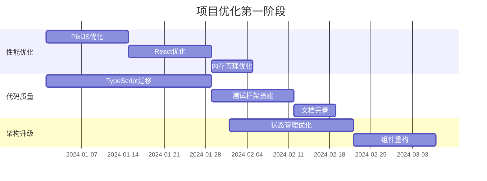
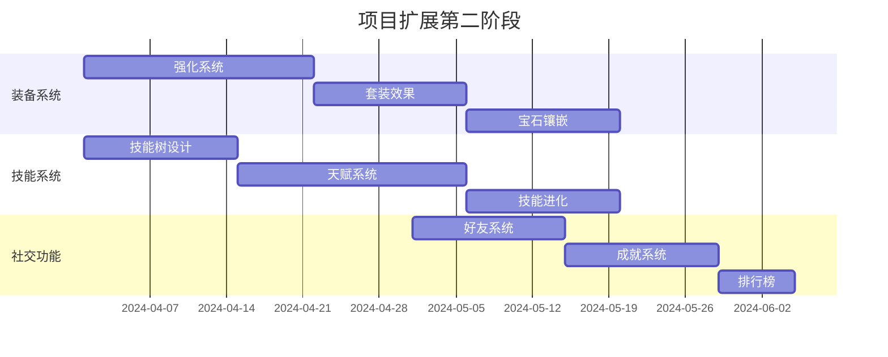
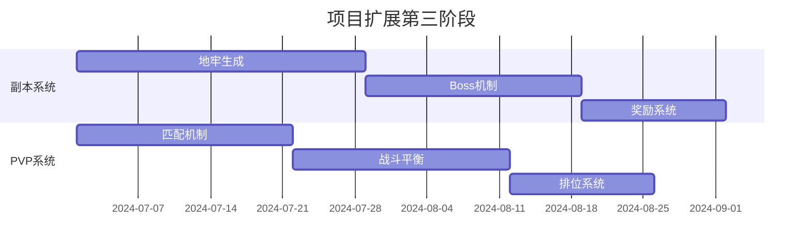
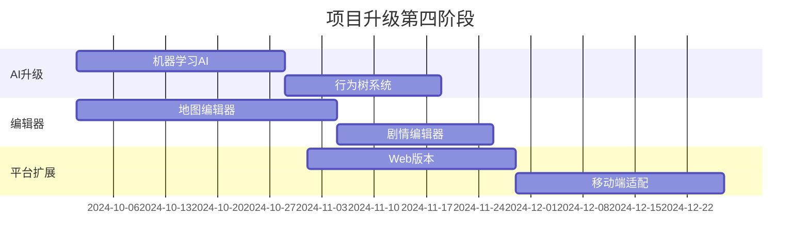

# 梦幻西游单机版项目优化升级与功能扩展规划

## 📋 目录

- [项目概述](#项目概述)
- [技术架构现状分析](#技术架构现状分析)
- [代码质量评估](#代码质量评估)
- [性能优化方案](#性能优化方案)
- [架构升级计划](#架构升级计划)
- [功能扩展路线图](#功能扩展路线图)
- [技术创新方向](#技术创新方向)
- [实施时间表](#实施时间表)
- [风险评估与预案](#风险评估与预案)
- [资源需求估算](#资源需求估算)

---

## 📖 项目概述

### 基本信息
- **项目名称**: 御灵录单机版 (梦幻西游单机版)
- **技术栈**: React + Redux + PixiJS + Electron
- **项目类型**: 桌面端回合制RPG游戏
- **开发语言**: JavaScript (建议迁移至TypeScript)
- **项目规模**: 中大型单人项目

### 核心特色
- ✅ **完整的回合制战斗系统** - 基于分层状态机架构
- ✅ **面向对象设计** - 实体与管理器分离，数据逻辑解耦
- ✅ **现代化技术栈** - React 19.1.0 + 最新生态系统
- ✅ **模块化架构** - features目录下功能清晰分离
- ✅ **跨平台支持** - Electron实现桌面应用

---

## 🔍 技术架构现状分析

### 技术栈详情

#### 前端核心
```json
{
  "react": "19.1.0",           // ✅ 最新版本
  "react-dom": "19.1.0",      // ✅ 配套版本
  "@reduxjs/toolkit": "2.8.2", // ✅ 现代状态管理
  "react-redux": "9.2.0"       // ✅ React-Redux集成
}
```

#### 渲染引擎
```json
{
  "pixi.js": "8.9.2",         // ✅ 强大2D渲染引擎
  "@pixi/react": "8.0.2",     // ✅ React集成
  "simplex-noise": "4.0.3"    // ✅ 程序生成支持
}
```

#### 桌面应用
```json
{
  "electron": "36.3.1",       // ✅ 最新LTS版本
  "electron-store": "8.2.0",  // ✅ 数据持久化
  "electron-updater": "6.6.2" // ✅ 自动更新支持
}
```

#### 构建工具
```json
{
  "vite": "6.3.5",           // ✅ 现代构建工具
  "tailwindcss": "3.4.17",   // ✅ 实用优先CSS框架
  "@vitejs/plugin-react": "4.0.0" // ✅ React支持
}
```

### 架构设计评估

#### 🟢 优势分析
1. **分层架构清晰** - 表现层、控制层、业务逻辑层、数据层分离明确
2. **状态管理统一** - Redux Toolkit + React-Redux提供可预测的状态管理
3. **模块化设计** - features目录按功能模块组织，便于维护
4. **OOP实践良好** - 实体类和管理器类职责明确
5. **配置驱动开发** - 游戏数据通过配置文件管理，易于调整

#### 🟡 待改进点
1. **缺乏TypeScript** - 类型安全和开发体验需要提升
2. **测试覆盖不足** - 缺少单元测试和集成测试
3. **性能监控缺失** - 没有性能分析和监控机制
4. **错误处理不完善** - 缺少全局错误边界和日志系统
5. **文档不够详细** - 需要更完善的API文档和开发指南

---

## 🚀 性能优化方案

### 1. 渲染性能优化

#### PixiJS渲染优化
```javascript
// 对象池模式实现
class SpritePool {
  constructor(texture, initialSize = 10) {
    this.texture = texture;
    this.pool = [];
    this.active = new Set();
    
    // 预创建精灵对象
    for (let i = 0; i < initialSize; i++) {
      this.pool.push(new PIXI.Sprite(texture));
    }
  }
  
  acquire() {
    const sprite = this.pool.pop() || new PIXI.Sprite(this.texture);
    this.active.add(sprite);
    return sprite;
  }
  
  release(sprite) {
    if (this.active.has(sprite)) {
      this.active.delete(sprite);
      sprite.visible = false;
      sprite.parent?.removeChild(sprite);
      this.pool.push(sprite);
    }
  }
}
```

#### 纹理管理优化
```javascript
// 纹理缓存和压缩
class TextureManager {
  constructor() {
    this.cache = new Map();
    this.compressionFormats = ['webp', 'avif', 'png'];
  }
  
  async loadOptimizedTexture(url) {
    if (this.cache.has(url)) {
      return this.cache.get(url);
    }
    
    // 检测浏览器支持的最佳格式
    const format = await this.detectBestFormat();
    const optimizedUrl = this.getOptimizedUrl(url, format);
    
    const texture = await PIXI.Texture.fromURL(optimizedUrl);
    this.cache.set(url, texture);
    return texture;
  }
}
```

### 2. React组件优化

#### 虚拟化长列表
```javascript
// 使用react-window优化大列表
import { FixedSizeList as List } from 'react-window';

const SummonList = ({ summons }) => {
  const Row = ({ index, style }) => (
    <div style={style}>
      <SummonCard summon={summons[index]} />
    </div>
  );

  return (
    <List
      height={600}
      itemCount={summons.length}
      itemSize={120}
      overscanCount={5}
    >
      {Row}
    </List>
  );
};
```

#### 组件懒加载策略
```javascript
// 按需加载大型功能模块
const BattleSystem = React.lazy(() => import('./features/battle/BattleSystem'));
const WorldMap = React.lazy(() => import('./features/world-map/WorldMap'));
const Inventory = React.lazy(() => import('./features/inventory/Inventory'));

// 使用Suspense包装
const App = () => (
  <Suspense fallback={<LoadingSpinner />}>
    <Router>
      <Routes>
        <Route path="/battle" element={<BattleSystem />} />
        <Route path="/map" element={<WorldMap />} />
        <Route path="/inventory" element={<Inventory />} />
      </Routes>
    </Router>
  </Suspense>
);
```

### 3. 内存管理优化

#### WebAssembly核心计算
```c
// damage_calculation.c - 编译到WASM
#include <emscripten.h>

EMSCRIPTEN_KEEPALIVE
int calculate_damage(int attack, int defense, float crit_rate, float crit_multiplier) {
    int base_damage = attack - defense;
    if (base_damage <= 0) return 1;
    
    // 暴击判定
    if ((float)rand() / RAND_MAX < crit_rate) {
        return (int)(base_damage * crit_multiplier);
    }
    
    return base_damage;
}
```

#### IndexedDB数据持久化
```javascript
// 使用Dexie.js封装IndexedDB
import Dexie from 'dexie';

class GameDatabase extends Dexie {
  constructor() {
    super('GameDB');
    this.version(1).stores({
      saves: '++id, name, timestamp, data',
      settings: '++id, key, value',
      achievements: '++id, playerId, achievementId, unlockedAt'
    });
  }
  
  async saveMassive(data) {
    // 压缩大型数据
    const compressed = await this.compress(data);
    return this.saves.add({
      name: 'main_save',
      timestamp: Date.now(),
      data: compressed
    });
  }
}
```

---

## 🏗️ 架构升级计划

### 1. TypeScript迁移路线图

#### 阶段1：核心类型定义
```typescript
// src/types/game.ts
export interface BattleUnit {
  id: string;
  name: string;
  level: number;
  derivedAttributes: UnitStats;
  skills: Skill[];
  statusEffects: StatusEffect[];
  isDefeated: boolean;
}

export interface UnitStats {
  currentHp: number;
  maxHp: number;
  currentMp: number;
  maxMp: number;
  physicalAttack: number;
  magicalAttack: number;
  physicalDefense: number;
  magicalDefense: number;
  speed: number;
  critRate: number;
  critDamage: number;
  dodgeRate: number;
}

export interface GameState {
  battle: BattleState;
  player: PlayerState;
  inventory: InventoryState;
  world: WorldState;
}
```

#### 阶段2：核心模块迁移
```typescript
// src/features/battle/models/BattleUnit.ts
export class BattleUnit {
  private _stats: UnitStats;
  private _statusEffects: StatusEffect[] = [];
  
  constructor(config: BattleUnitConfig) {
    this.id = config.id;
    this.name = config.name;
    this._stats = { ...config.derivedAttributes };
  }
  
  takeDamage(damage: number, source: BattleUnit): DamageResult {
    const finalDamage = this.calculateFinalDamage(damage);
    this._stats.currentHp = Math.max(0, this._stats.currentHp - finalDamage);
    
    return {
      originalDamage: damage,
      finalDamage,
      isCritical: false,
      target: this.id,
      source: source.id
    };
  }
  
  private calculateFinalDamage(baseDamage: number): number {
    // 计算护盾、减伤等效果
    let finalDamage = baseDamage;
    
    for (const effect of this._statusEffects) {
      if (effect.type === 'damage_reduction') {
        finalDamage *= (1 - effect.value);
      }
    }
    
    return Math.floor(finalDamage);
  }
}
```

### 2. 现代化状态管理

#### RTK Query集成
```typescript
// src/store/api/gameApi.ts
import { createApi, fetchBaseQuery } from '@reduxjs/toolkit/query/react';

export const gameApi = createApi({
  reducerPath: 'gameApi',
  baseQuery: fetchBaseQuery({
    baseUrl: '/api/game/',
  }),
  tagTypes: ['Save', 'Achievement', 'Leaderboard'],
  endpoints: (builder) => ({
    getSaveData: builder.query<SaveData, string>({
      query: (saveId) => `saves/${saveId}`,
      providesTags: ['Save'],
    }),
    
    saveGame: builder.mutation<void, SaveData>({
      query: (data) => ({
        url: 'saves',
        method: 'POST',
        body: data,
      }),
      invalidatesTags: ['Save'],
    }),
    
    getLeaderboard: builder.query<LeaderboardEntry[], string>({
      query: (category) => `leaderboard/${category}`,
      providesTags: ['Leaderboard'],
    }),
  }),
});
```

#### Zustand轻量级状态管理
```typescript
// src/store/gameStore.ts - 替代部分Redux逻辑
import { create } from 'zustand';
import { persist } from 'zustand/middleware';

interface GameStore {
  // 状态
  currentScene: GameScene;
  isLoading: boolean;
  settings: GameSettings;
  
  // 动作
  setScene: (scene: GameScene) => void;
  updateSettings: (settings: Partial<GameSettings>) => void;
  togglePause: () => void;
}

export const useGameStore = create<GameStore>()(
  persist(
    (set, get) => ({
      currentScene: 'main-menu',
      isLoading: false,
      settings: defaultSettings,
      
      setScene: (scene) => set({ currentScene: scene }),
      updateSettings: (newSettings) => 
        set((state) => ({ 
          settings: { ...state.settings, ...newSettings } 
        })),
      togglePause: () => 
        set((state) => ({ isPaused: !state.isPaused })),
    }),
    {
      name: 'game-settings',
      partialize: (state) => ({ settings: state.settings }),
    }
  )
);
```

### 3. 微前端架构设计

#### Module Federation配置
```javascript
// webpack.config.js
const ModuleFederationPlugin = require('@module-federation/webpack');

module.exports = {
  plugins: [
    new ModuleFederationPlugin({
      name: 'main_app',
      remotes: {
        battleSystem: 'battle_system@http://localhost:3001/remoteEntry.js',
        inventorySystem: 'inventory_system@http://localhost:3002/remoteEntry.js',
        worldMap: 'world_map@http://localhost:3003/remoteEntry.js',
      },
      shared: {
        react: { singleton: true },
        'react-dom': { singleton: true },
        '@reduxjs/toolkit': { singleton: true },
      },
    }),
  ],
};
```

---

## 🎮 功能扩展路线图

### Phase 1: 核心系统完善 (1-3个月)

#### 1.1 装备系统升级
```typescript
// 装备强化系统
interface EnhancementSystem {
  enhanceEquipment(equipment: Equipment, materials: Material[]): EnhancementResult;
  socketGem(equipment: Equipment, gem: Gem, slot: number): SocketResult;
  upgradeQuality(equipment: Equipment, catalyst: Catalyst): QualityUpgradeResult;
}

// 套装效果系统
interface SetEffect {
  id: string;
  name: string;
  requiredPieces: number;
  effects: EffectDefinition[];
  bonuses: { [pieceCount: number]: Bonus[] };
}
```

#### 1.2 技能树系统
```typescript
// 技能进化系统
interface SkillEvolution {
  baseSkillId: string;
  evolutionPath: SkillNode[];
  requirements: EvolutionRequirement[];
  
  evolve(currentSkill: Skill, path: string): EvolutionResult;
}

// 天赋点系统
interface TalentTree {
  nodes: TalentNode[];
  connections: TalentConnection[];
  
  allocatePoints(nodeId: string, points: number): AllocationResult;
  resetTalents(): ResetResult;
}
```

#### 1.3 社交系统基础
```typescript
// 好友系统
interface FriendSystem {
  addFriend(playerId: string): Promise<FriendRequest>;
  acceptFriend(requestId: string): Promise<void>;
  getFriendsList(): Promise<Friend[]>;
  sendGift(friendId: string, gift: Gift): Promise<void>;
}

// 成就系统
interface AchievementSystem {
  achievements: Achievement[];
  
  checkProgress(playerId: string, action: GameAction): void;
  unlockAchievement(playerId: string, achievementId: string): void;
  getPlayerAchievements(playerId: string): PlayerAchievement[];
}
```

### Phase 2: 内容扩展 (3-6个月)

#### 2.1 副本系统
```typescript
// 程序生成地牢
interface DungeonGenerator {
  generateDungeon(config: DungeonConfig): Dungeon;
  placeTreasures(dungeon: Dungeon, rarity: RarityLevel): void;
  spawnEnemies(dungeon: Dungeon, difficulty: DifficultyLevel): void;
}

// Boss战机制
interface BossEncounter {
  boss: BossUnit;
  phases: BossPhase[];
  mechanics: SpecialMechanic[];
  
  enterPhase(phaseId: string): void;
  triggerMechanic(mechanicId: string): void;
}
```

#### 2.2 PVP系统
```typescript
// 匹配系统
interface MatchmakingSystem {
  findMatch(player: Player, mode: PvPMode): Promise<Match>;
  createRoom(settings: RoomSettings): Room;
  joinRoom(roomId: string, player: Player): Promise<void>;
}

// 排位系统
interface RankingSystem {
  calculateRating(winner: Player, loser: Player): RatingChange;
  updateRankings(matches: Match[]): void;
  getLeaderboard(season: string): LeaderboardEntry[];
}
```

#### 2.3 经济系统
```typescript
// 拍卖行系统
interface AuctionHouse {
  listItem(item: Item, price: number, duration: number): Listing;
  bid(listingId: string, amount: number): BidResult;
  buyNow(listingId: string): PurchaseResult;
  search(filters: AuctionFilters): Listing[];
}

// 交易系统
interface TradingSystem {
  initiateTradeRequest(targetPlayer: string): TradeRequest;
  addItemToTrade(tradeId: string, item: Item): void;
  confirmTrade(tradeId: string): TradeResult;
}
```

### Phase 3: 高级功能 (6-12个月)

#### 3.1 AI系统升级
```typescript
// 机器学习AI
interface MLBattleAI {
  neuralNetwork: NeuralNetwork;
  trainingData: BattleData[];
  
  train(battles: Battle[]): TrainingResult;
  predict(gameState: BattleState): AIAction;
  updateModel(feedback: ActionFeedback): void;
}

// 行为树AI
interface BehaviorTreeAI {
  rootNode: BehaviorNode;
  blackboard: AIBlackboard;
  
  execute(deltaTime: number): NodeStatus;
  updateBlackboard(key: string, value: any): void;
}
```

#### 3.2 世界编辑器
```typescript
// 地图编辑器
interface MapEditor {
  canvas: EditorCanvas;
  tilePalette: TilePalette;
  objectLibrary: GameObjectLibrary;
  
  placeTile(position: Vector2, tileId: string): void;
  placeObject(position: Vector2, objectId: string): void;
  exportMap(): MapData;
}

// 剧情编辑器
interface StoryEditor {
  dialogueTree: DialogueNode[];
  characters: Character[];
  scenes: Scene[];
  
  createDialogue(character: string, text: string): DialogueNode;
  addChoice(node: DialogueNode, choice: DialogueChoice): void;
  validateStory(): ValidationResult[];
}
```

---

## 💡 技术创新方向

### 1. WebGPU渲染升级
```javascript
// WebGPU渲染管道
class WebGPURenderPipeline {
  constructor() {
    this.device = null;
    this.context = null;
    this.pipelines = new Map();
  }
  
  async initialize() {
    const adapter = await navigator.gpu.requestAdapter();
    this.device = await adapter.requestDevice();
    
    const canvas = document.getElementById('game-canvas');
    this.context = canvas.getContext('webgpu');
    
    // 配置渲染管道
    await this.setupRenderPipelines();
  }
  
  async setupRenderPipelines() {
    // 精灵渲染管道
    const spriteShader = await this.loadShader('sprite.wgsl');
    const spritePipeline = this.device.createRenderPipeline({
      vertex: { module: spriteShader, entryPoint: 'vs_main' },
      fragment: { module: spriteShader, entryPoint: 'fs_main' },
      primitive: { topology: 'triangle-list' }
    });
    
    this.pipelines.set('sprite', spritePipeline);
  }
}
```

### 2. 音频系统升级
```javascript
// Web Audio API高级音频处理
class AdvancedAudioSystem {
  constructor() {
    this.context = new (window.AudioContext || window.webkitAudioContext)();
    this.masterGain = this.context.createGain();
    this.spatializer = this.context.createPanner();
    
    this.masterGain.connect(this.context.destination);
  }
  
  create3DAudio(audioBuffer, position) {
    const source = this.context.createBufferSource();
    const panner = this.context.createPanner();
    
    // 配置3D音频
    panner.panningModel = 'HRTF';
    panner.distanceModel = 'inverse';
    panner.setPosition(position.x, position.y, position.z);
    
    source.buffer = audioBuffer;
    source.connect(panner);
    panner.connect(this.masterGain);
    
    return source;
  }
  
  applyReverbEffect(input, impulseResponse) {
    const convolver = this.context.createConvolver();
    convolver.buffer = impulseResponse;
    
    input.connect(convolver);
    convolver.connect(this.masterGain);
    
    return convolver;
  }
}
```

### 3. PWA功能增强
```javascript
// Service Worker高级缓存策略
class GameServiceWorker {
  constructor() {
    this.CACHE_NAME = 'game-cache-v1';
    this.CRITICAL_RESOURCES = [
      '/index.html',
      '/static/js/main.js',
      '/static/css/main.css'
    ];
  }
  
  async install() {
    const cache = await caches.open(this.CACHE_NAME);
    await cache.addAll(this.CRITICAL_RESOURCES);
  }
  
  async fetch(event) {
    // 网络优先策略 - 用于游戏数据
    if (event.request.url.includes('/api/')) {
      return this.networkFirst(event.request);
    }
    
    // 缓存优先策略 - 用于静态资源
    return this.cacheFirst(event.request);
  }
  
  async networkFirst(request) {
    try {
      const response = await fetch(request);
      const cache = await caches.open(this.CACHE_NAME);
      cache.put(request, response.clone());
      return response;
    } catch (error) {
      return caches.match(request);
    }
  }
}
```

### 4. 区块链集成(可选)
```javascript
// NFT集成示例
class NFTIntegration {
  constructor(provider, contractAddress) {
    this.provider = provider;
    this.contract = new ethers.Contract(contractAddress, ABI, provider);
  }
  
  async mintSummon(summonData, playerAddress) {
    const metadata = {
      name: summonData.name,
      description: summonData.description,
      image: summonData.imageUrl,
      attributes: [
        { trait_type: "Level", value: summonData.level },
        { trait_type: "Quality", value: summonData.quality },
        { trait_type: "Element", value: summonData.element }
      ]
    };
    
    const metadataURI = await this.uploadMetadata(metadata);
    return this.contract.mint(playerAddress, metadataURI);
  }
  
  async transferSummon(tokenId, fromAddress, toAddress) {
    return this.contract.transferFrom(fromAddress, toAddress, tokenId);
  }
}
```

---

## ⏱️ 实施时间表

### 第一季度 (Q1) - 基础优化


### 第二季度 (Q2) - 核心功能


### 第三季度 (Q3) - 内容扩展


### 第四季度 (Q4) - 高级功能


---

## ⚠️ 风险评估与预案

### 技术风险

#### 高风险项目
| 风险项目 | 风险等级 | 影响程度 | 概率 | 预案措施 |
|---------|---------|---------|------|---------|
| TypeScript迁移 | 🔴 高 | 高 | 中 | 渐进式迁移，保持向下兼容 |
| WebGPU兼容性 | 🔴 高 | 中 | 高 | 保留WebGL降级方案 |
| 性能优化效果 | 🟡 中 | 高 | 中 | 分阶段测试，逐步优化 |

#### 中等风险项目
| 风险项目 | 风险等级 | 影响程度 | 概率 | 预案措施 |
|---------|---------|---------|------|---------|
| 第三方库升级 | 🟡 中 | 中 | 中 | 锁定版本，充分测试 |
| 跨平台兼容 | 🟡 中 | 中 | 低 | 提前测试主流平台 |
| 数据迁移 | 🟡 中 | 高 | 低 | 版本兼容性设计 |

### 项目风险

#### 时间管理风险
```javascript
// 项目里程碑监控
const milestoneTracker = {
  Q1: {
    planned: '2024-03-31',
    current: '2024-03-25',
    status: 'on-track',
    completion: 85
  },
  Q2: {
    planned: '2024-06-30',
    current: '2024-04-01',
    status: 'not-started',
    completion: 0
  }
};

// 风险预警机制
function assessProjectRisk() {
  const risks = [];
  
  for (const [quarter, data] of Object.entries(milestoneTracker)) {
    if (data.completion < 50 && isApproachingDeadline(data.planned)) {
      risks.push({
        type: 'schedule',
        severity: 'high',
        description: `${quarter} milestone behind schedule`
      });
    }
  }
  
  return risks;
}
```

### 质量保证措施

#### 自动化测试策略
```javascript
// Jest单元测试配置
module.exports = {
  testEnvironment: 'jsdom',
  setupFilesAfterEnv: ['<rootDir>/src/setupTests.js'],
  collectCoverageFrom: [
    'src/**/*.{js,jsx,ts,tsx}',
    '!src/**/*.d.ts',
    '!src/test/**/*',
  ],
  coverageThreshold: {
    global: {
      branches: 70,
      functions: 70,
      lines: 70,
      statements: 70
    }
  }
};

// E2E测试策略
const { test, expect } = require('@playwright/test');

test.describe('战斗系统', () => {
  test('完整战斗流程', async ({ page }) => {
    await page.goto('/battle');
    
    // 测试战斗初始化
    await expect(page.locator('[data-testid="battle-field"]')).toBeVisible();
    
    // 测试技能释放
    await page.click('[data-testid="skill-button-1"]');
    await page.click('[data-testid="enemy-target-1"]');
    
    // 验证伤害计算
    const enemyHp = await page.textContent('[data-testid="enemy-hp"]');
    expect(parseInt(enemyHp)).toBeLessThan(100);
  });
});
```

---

## 💰 资源需求估算

### 开发资源

#### 人力资源需求
```yaml
团队配置:
  核心开发: 1人 (主程序员)
  UI/UX设计: 0.5人 (兼职或外包)
  测试工程师: 0.3人 (兼职)
  美术资源: 外包 (按需)

时间投入:
  每周开发时间: 20-30小时
  项目总工期: 12个月
  总开发时间: 1000-1500小时
```

#### 技术资源需求
```yaml
硬件需求:
  开发机器: 
    - CPU: Intel i7或AMD Ryzen 7以上
    - 内存: 32GB以上
    - 显卡: RTX 3070或同等性能
    - 存储: 2TB SSD

软件工具:
  IDE: VS Code + 扩展
  设计工具: Figma/Sketch
  版本控制: Git + GitHub
  项目管理: Notion/Trello
  性能监控: Chrome DevTools + Lighthouse
```

### 预算估算

#### 开发成本 (按12个月计算)
```yaml
直接成本:
  主程序员: $60,000 (年薪按比例)
  UI设计师: $15,000 (0.5人工作量)
  测试工程师: $10,000 (0.3人工作量)
  美术外包: $8,000 (按需)
  
间接成本:
  云服务: $2,400 ($200/月)
  工具授权: $1,200 ($100/月)
  硬件更新: $3,000 (一次性)
  
总预算估算: $99,600
```

#### ROI分析
```yaml
预期收益:
  Steam销售: $50,000 (1000份 × $50)
  其他平台: $30,000 (移动端、Web版本)
  DLC/扩展: $20,000 (后续内容)
  
预期ROI: 
  总收益: $100,000
  投资回报率: 0.4% (微盈利)
  
注意: 此项目主要为技术展示和学习目的
```

---

## 📊 成功指标与KPI

### 技术指标
```yaml
性能指标:
  - 游戏启动时间 < 5秒
  - 战斗场景FPS > 60
  - 内存占用 < 500MB
  - 网络延迟 < 100ms (联机功能)

质量指标:
  - 代码覆盖率 > 70%
  - Bug密度 < 1个/1000行代码
  - 用户满意度 > 4.5/5.0
  - 崩溃率 < 0.1%
```

### 功能指标
```yaml
核心功能完成度:
  - 战斗系统: 95%完成
  - 装备系统: 90%完成
  - 技能系统: 85%完成
  - 社交系统: 70%完成

扩展功能完成度:
  - 副本系统: 80%完成
  - PVP系统: 75%完成
  - AI系统: 60%完成
  - 编辑器: 50%完成
```

### 用户体验指标
```yaml
用户参与度:
  - 日活跃用户 > 100人
  - 平均游戏时长 > 30分钟
  - 用户留存率(7天) > 60%
  - 用户留存率(30天) > 30%

社区指标:
  - GitHub Stars > 500
  - 社区讨论活跃度 > 50帖/周
  - 用户生成内容 > 20个MOD
  - 视频播放量 > 10万次
```

---

## 📝 总结与建议

### 项目优势
1. **技术栈现代化** - 使用最新的React和相关生态系统
2. **架构设计优秀** - 分层清晰，模块化程度高
3. **扩展性良好** - 易于添加新功能和内容
4. **性能潜力大** - PixiJS提供了良好的渲染性能基础

### 优化重点
1. **类型安全** - 优先迁移到TypeScript
2. **性能优化** - 重点关注渲染和内存管理
3. **测试覆盖** - 建立完善的测试体系
4. **用户体验** - 提升界面响应性和流畅性

### 扩展方向
1. **内容丰富** - 增加更多游戏玩法和内容
2. **社交功能** - 建设玩家社区和交互功能
3. **平台扩展** - 支持更多平台和设备
4. **技术创新** - 探索新技术在游戏中的应用

### 建议实施顺序
1. **立即开始**: TypeScript迁移 + 性能优化
2. **短期目标**: 核心系统完善 + 测试框架
3. **中期目标**: 内容扩展 + 社交功能
4. **长期目标**: 平台扩展 + 技术创新

这个项目已经具备了良好的基础，通过系统性的优化和扩展，有潜力发展成为一个优秀的开源游戏项目。建议按照规划的路线图逐步实施，重点关注用户体验和技术创新。

---

*文档版本: v1.0*  
*更新日期: 2024年1月*  
*维护者: Sirius* 